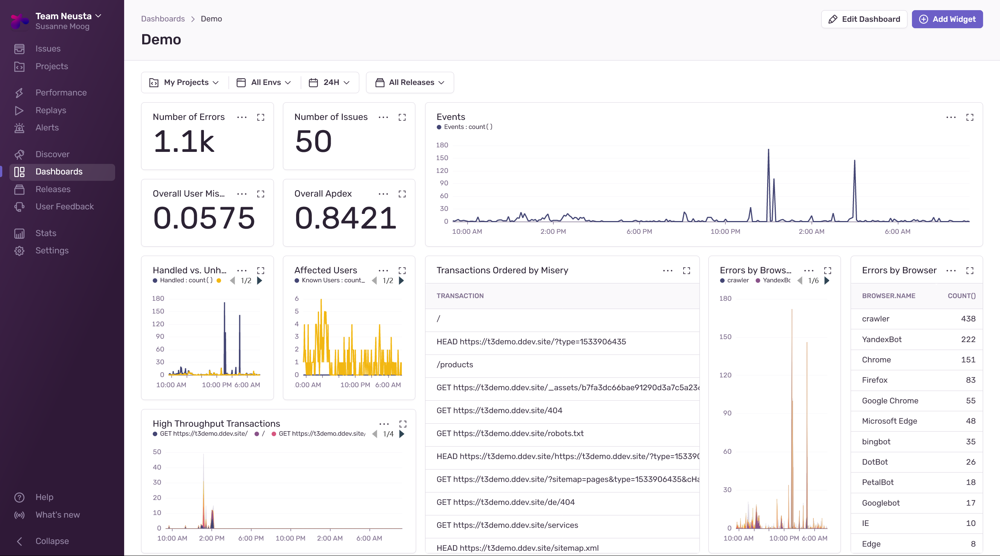
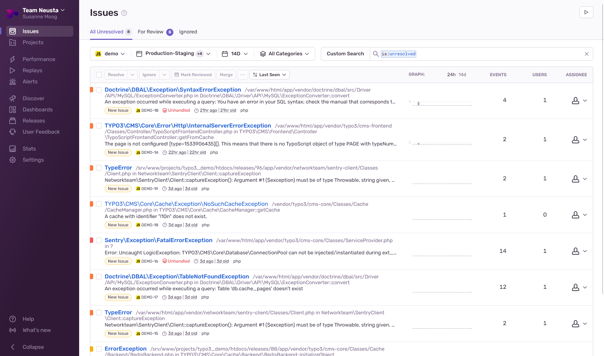
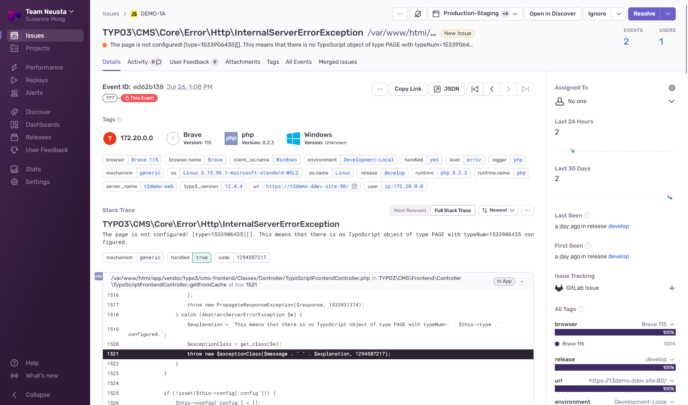
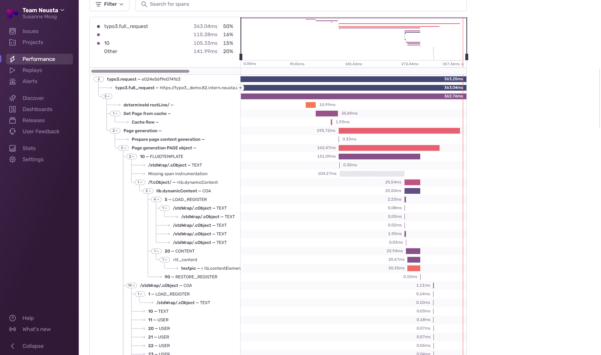
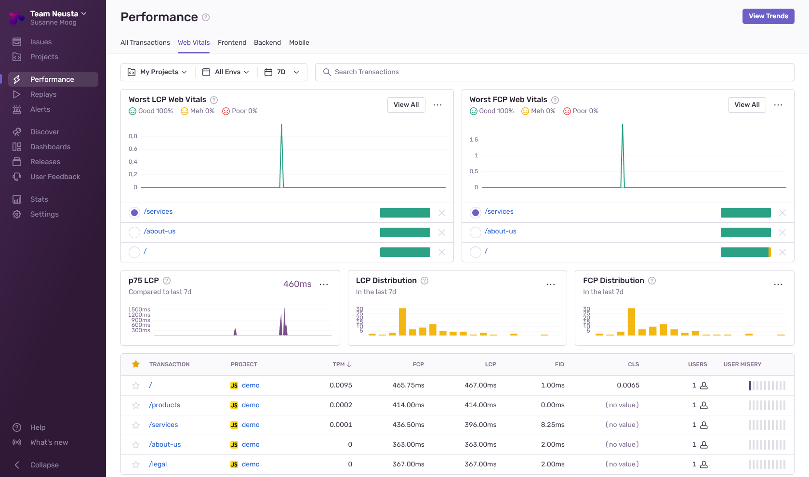
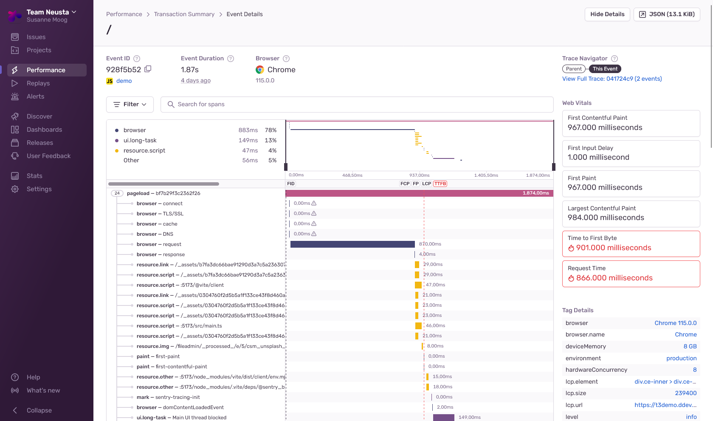
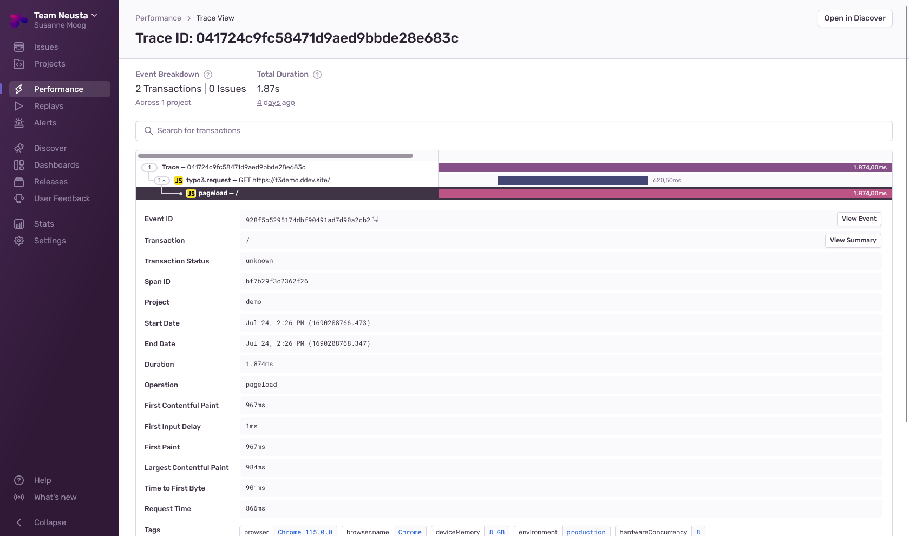
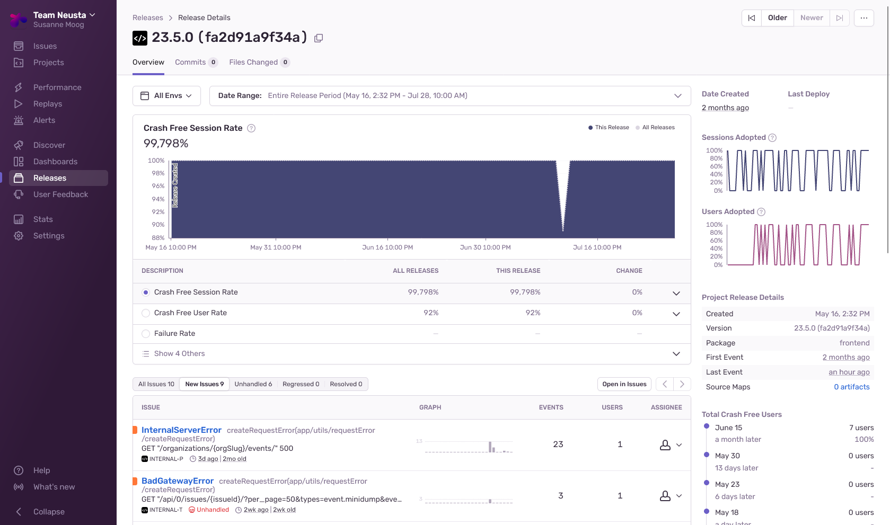

# Sentry & TYPO3 
### Susi Moog @ T3DD23
[@psychomieze@norden.social](https://norden.social/@psychomieze)
---
## Agenda
	1. Introduction
	2. Overview of Sentry
	3. Integrating Sentry with TYPO3
	4. Frontend Performance Analysis with Sentry and TYPO3 
	5. Sentry Integration with GitLab CI 
	7. Optional Live Demo
	8. Q&A
---
## Introduction
- Why do you need centralized error logging / monitoring?
	- Multi-Server Setup (think: Cloud) <!-- .element: class="fragment" data-fragment-index="1" -->
	- Many Projects in Maintenance Mode <!-- .element: class="fragment" data-fragment-index="2" -->
	- Editors! Marketers! (they do things!) <!-- .element: class="fragment" data-fragment-index="3" -->

---
## Overview of Sentry

%%
## Overview of Sentry
- Error Tracking
- Performance Monitoring
- Alerting
- SaaS or Self-Hosted Environment
- Various Integrations (Jira, GitLab, ...)

---

## Sentry & TYPO3 

Note: Error Tracking easier, Performance a bit more work

%%

### Error Tracking
- `composer req networkteam/sentry-client`
- Expose environment variables: 

```bash
SENTRY_DSN=http://public_key@your-sentry-server.com/project-id
SENTRY_RELEASE=1.0.7
SENTRY_ENVIRONMENT=Staging
```
%%

### Error Tracking

Set `ProductionExceptionHandler` in 
  `config/system/settings.php`

```php
return [
	// ...
	'SYS' => [
		productionExceptionHandler' => 
            \Networkteam\SentryClient\ProductionExceptionHandler::class;
	]
];
```

Optional:

```php
\Networkteam\SentryClient\SentryLogWriter::class
```

Note: ExceptionHandler (Production or Debug is mostly enough), LogWriter can be used additionally.

%% 

### Error Tracking


%% 

### Error Tracking



---
## Performance (BE)

- Automated solutions for Laravel and Symfony
- Manual tracking for TYPO3 necessary
- As a proof of concept: 

```bash
composer require neusta/sentry-tracing-typo3
```

Note: Extends the Timetracker

%%
## Performance (BE)



%%
## Performance (BE)

```php [9-12]
$transactionContext = new \Sentry\Tracing\TransactionContext();
$transactionContext->setName('Example Transaction');
$transactionContext->setOp('http.server');
$transaction = \Sentry\startTransaction($transactionContext);
\Sentry\SentrySdk::getCurrentHub()->setSpan($transaction);
$spanContext = new \Sentry\Tracing\SpanContext();
$spanContext->setOp('expensive_operation');

$span1 = $transaction->startChild($spanContext);
\Sentry\SentrySdk::getCurrentHub()->setSpan($span1);
// whatever you want to trace goes here ... 
$span1->finish();

\Sentry\SentrySdk::getCurrentHub()->setSpan($transaction);
$transaction->finish();
```

Note: See example extension for more info - once the next version of sentry_client is released, 
extending will be much easier.

---

## Performance (FE)
- Moar JavaScript, moar FE performance important
- Web Vitals
- Error Tracing (incl. Client Info)
- Highly individual setup

%%
## Performance (FE)
### Setup Example

```typescript
import * as Sentry from "@sentry/browser";

Sentry.init({
  dsn: "https://yourkey@sentry.yourdomain.de/18",

  integrations: [
    new Sentry.BrowserTracing(),
  ],

  tracesSampleRate: 0.2,
});

```

%%
## Performance (FE)



%%
## Performance (FE)



---

## Performance
### All Together Now

- Connect Backend & Frontend Metrics
- Sentry Meta Tags: baggage & sentry-trace

%%

## Performance

```html
<nsd:metaTag content="{sentry.baggage}" name="baggage" />
<nsd:metaTag content="{sentry.trace}" name="sentry-trace" />
```

``` html
<meta name="sentry-trace" 
    content="49879feb76c84743ba5034bd2d3f1ca3-7cb5535c930d4666-1"/>
<meta name="baggage" 
    content="sentry-trace_id=49879feb76c84743ba5034bd2d3f1ca3,
        sentry-sample_rate=0.2,
        sentry-transaction=my-transaction,sentry-public_key=public,
        sentry-release=1.0.0,sentry-environment=prod">
```

Note: see example tracing extension for a data processor providing
the necessary info from sentry

%% 

## Performance




---

## Track Commits & Releases

- Know which release / commits are responsible for errors
- Get better StackTraces in Sentry
- Connect Gitlab, Github, Bitbucket or Phabricator

%%
## Gitlab Example

```yaml
sentry_release:
 image: getsentry/sentry-cli:latest
 script:
  - export SENTRY_URL=https://sentry.neusta.de
  - export SENTRY_AUTH_TOKEN=$NEUSTA_SENTRY_INTEGRATION_TOKEN
  - export SENTRY_ORG=team-neusta
  - export SENTRY_PROJECT=demo
  - sentry-cli releases new "$CI_COMMIT_SHORT_SHA"
  # the spaces are required - otherwise it won't work
  - sentry-cli releases set-commits "$CI_COMMIT_SHORT_SHA" --commit \
    "NSD / p_typo3_demo / TYPO3 Demo@$CI_COMMIT_SHA"
  - sentry-cli releases finalize "$CI_COMMIT_SHORT_SHA"
  - sentry-cli releases deploys "$CI_COMMIT_SHORT_SHA" new -e staging
```

Note: Gitlab integration has to be set up in Sentry

%% 

## Release View



---

## Additional Features

- SAML / SCIM Provisioning 
- Frontend Session Replays
- Collecting User Feedback
- Multi-Project Performance Monitoring

--- 

## Optional: Live Demo

https://sentry.neusta.de

---

## Thank You

